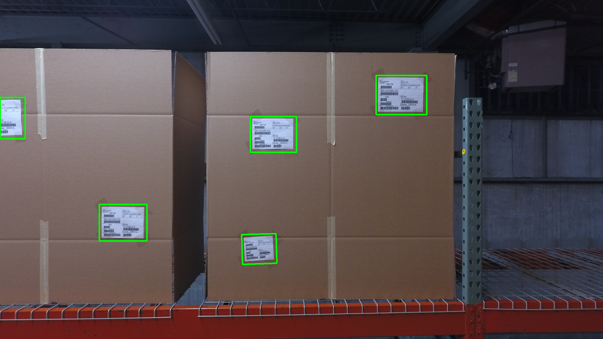
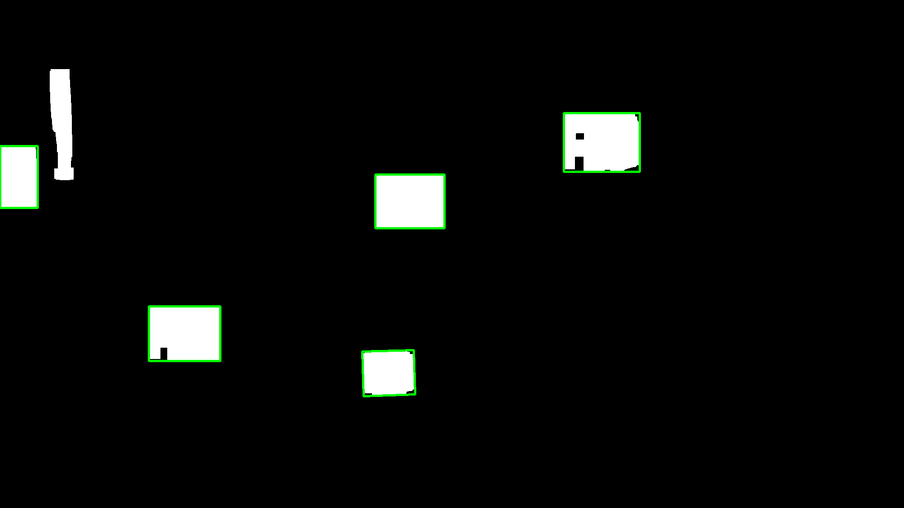
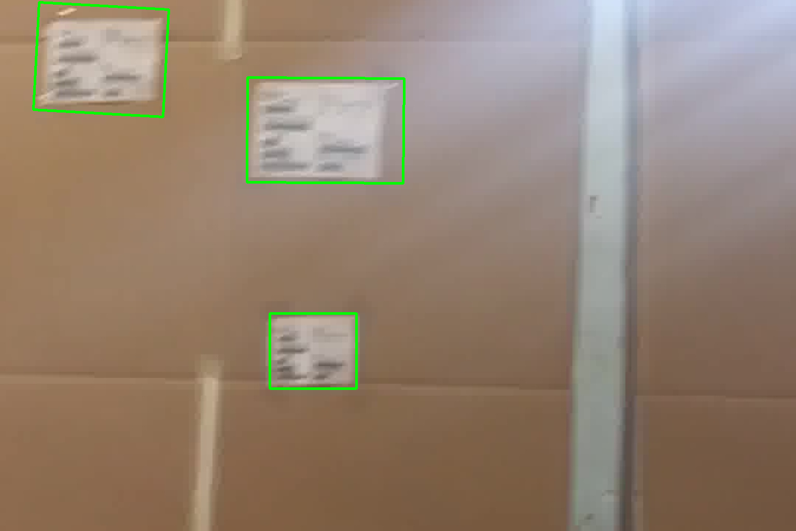
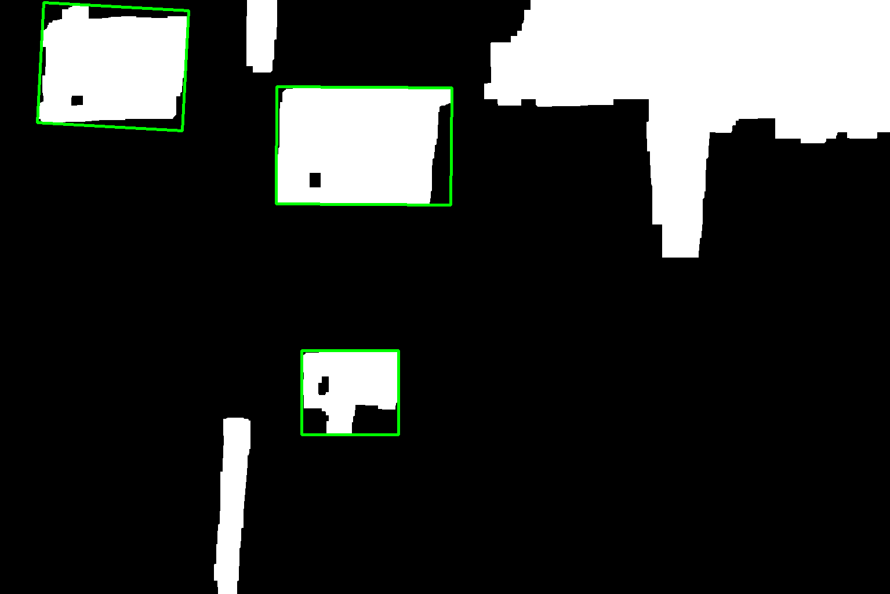

# cv_coding_challenge
IFM coding challenge

See my code in sol.py, I extract the requested features to found_tags. The confidence value is mostly useless it's just the percent of pixels in the fitted rectangle that are white

Identified Frame | Mask
------------ | -------------
 | 
 | 

Out data 1:
```
{
    "uv": [
        604.4999389648438, 
        677.4999389648438
    ], 
    "theta": -0.0, 
    "p": 623.9998779296875, 
    "a": 24214.990478516556, 
    "mu": 0.7283504825511897
}
{
    "uv": [
        627.87939453125, 
        251.41232299804688
    ], 
    "theta": -89.64412689208984, 
    "p": 1007.1481628417969, 
    "a": 60946.55979316402, 
    "mu": 0.8904522287095048
}
{
    "uv": [
        194.92147827148438, 
        115.00743103027344
    ], 
    "theta": -86.86975860595703, 
    "p": 914.7424926757812, 
    "a": 51827.32436198741, 
    "mu": 0.8353122707556244
}
```

Out data 2:
```
{
    "uv": [
        859.8844604492188, 
        826.300537109375
    ], 
    "theta": -1.7899105548858643, 
    "p": 426.72918701171875, 
    "a": 11317.92199785792, 
    "mu": 0.9462867832122382
}
{
    "uv": [
        408.99993896484375, 
        739.4999389648438
    ], 
    "theta": -0.0, 
    "p": 557.9999084472656, 
    "a": 19117.99389648484, 
    "mu": 0.9592533661898452
}
{
    "uv": [
        906.5, 
        445.5
    ], 
    "theta": -0.0, 
    "p": 543.9999084472656, 
    "a": 18206.994033813942, 
    "mu": 0.9967591593606022
}
{
    "uv": [
        41.5, 
        391.5
    ], 
    "theta": -0.0, 
    "p": 440.0, 
    "a": 11371.0, 
    "mu": 0.9813560812593439
}
{
    "uv": [
        1331.0, 
        315.0
    ], 
    "theta": -0.0, 
    "p": 596.0, 
    "a": 21840.0, 
    "mu": 0.9322802197802198
}
```
