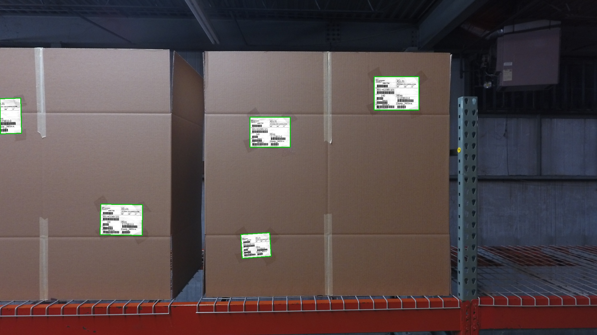
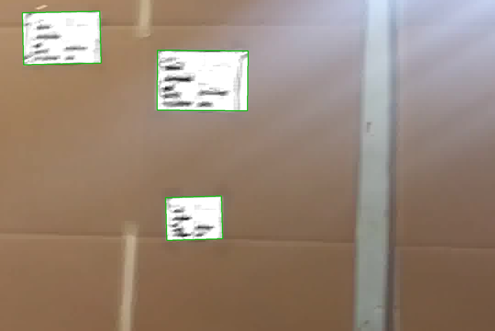
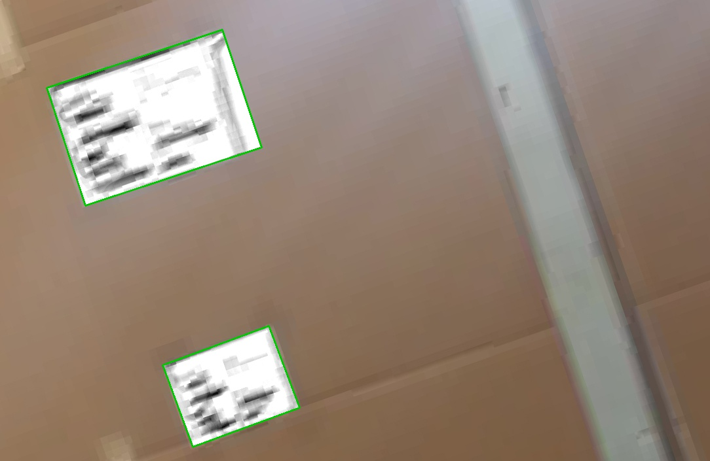

# Intelligent Flying Machines 

I ran this pipeline on the two images provided, and also created two modified images to 
experiment on: a rotated version of the low resolution image, and a flipped version of 
the low resolution image with two additional labels placed onto the box.

The pipeline returns the annotated images; the label is normalized and outlined in green. 

 

# Scripts and functions

    labelFinder.py -- contains the main functions for finding and annotating labels
    highres_ex_script.py -- a script to input parameters and run the functions in labelFinder.py
    lowres_ex_script.py -- a script to input parameters and run the functions in labelFinder.py
    labelWindow.py -- contains functions for displaying trackbars and updates the window with parameter changes
    parameter_trackbar_ex_script.py -- a script to run labelWindow.py; example images were input here
    
# Requirements

These scripts and functions have been tested on OpenCV 3.2.0, OpenCV 3.1.0, Python 3.5.2, and Python 3.6.1.

# To-do

Currently `highres_ex_script.py`, `lowres_ex_script.py` and `labelWindow.py` do output the locations, orientations, perimeter, and area of the labels, but I need to return them from `labelWindow.py`, preferably in an object or list format for any additional scripts. Also, there is currently no calculation for confidence in the label prediction; my current idea for implementation is to use template matching to calculate correlation between all the labels. This will work for an image with many labels, but won't be useful when there is only one label in the image. I could also find if there exists barcodes/text lines in the labels by looking where they should be and see if darker values appear, but this seems like it won't produce a robust metric.

# Other stuff

You can find more about me on my website, http://reynoldsalexander.com

Thanks to [ferret-guy](https://github.com/ferret-guy) for putting this repo online so that I could clone it just hours after IFM removed the repo!
